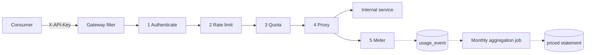

# API Monetization Gateway

A programmable gateway that sits between external API consumers and internal services. For every
inbound call it authenticates the caller, resolves the commercial tier they are on, enforces that
tier's per-second rate limit and monthly quota, forwards the call, and records it so a scheduled job
can price the month.

Built with Java 21 and Spring Boot 3.5, backed by JPA and an in-memory H2 database so it runs with
no external dependencies.

| Tier | Monthly quota | Rate limit | Price |
|------|---------------|-----------|-------|
| Free | 100 requests | 2 req/s | $0 |
| Pro  | 100,000 requests | 10 req/s | $50/month + $0.001 per request over quota |

These are seeded rows, not constants. Quota, rate limit and pricing are all editable at runtime
through the admin API and take effect on the next request.

---

## Run it

```bash
mvn spring-boot:run
```

```bash
mvn test
```

The app starts on port 8080 and seeds two demo customers. If 8080 is busy:
`mvn spring-boot:run -Dspring-boot.run.arguments=--server.port=8899`.

### Try it

```bash
curl -i -H "X-API-Key: amk_live_demo_free_key" http://localhost:8080/api/v1/weather
```

```
HTTP/1.1 200
X-Tier: FREE
X-RateLimit-Limit: 2
X-RateLimit-Remaining: 1
X-Quota-Limit: 100
X-Quota-Remaining: 99
X-Quota-Period: 2026-08
```

Exceed the free tier's 2 requests per second:

```bash
for i in 1 2 3 4; do curl -s -H "X-API-Key: amk_live_demo_free_key" http://localhost:8080/api/v1/weather; done
```

```json
{
  "status": 429,
  "code": "RATE_LIMIT_EXCEEDED",
  "message": "Rate limit of 2 requests per second exceeded for tier FREE",
  "path": "/api/v1/weather",
  "details": { "limitPerSecond": 2, "retryAfterMillis": 341, "tier": "FREE" }
}
```

Close the month and read the priced statement:

```bash
curl -X POST "http://localhost:8080/admin/billing/aggregate?period=$(date -u +%Y-%m)"
```

```bash
curl "http://localhost:8080/admin/billing/summaries?period=$(date -u +%Y-%m)"
```

```json
[{
  "customerId": 2, "billingPeriod": "2026-08", "tierCode": "PRO",
  "totalRequests": 8, "includedRequests": 8, "overageRequests": 0,
  "baseCharge": 50.00, "overageCharge": 0.00, "totalCharge": 50.00,
  "endpoints": [
    { "endpoint": "/api/v1/weather",        "httpMethod": "GET", "requestCount": 6 },
    { "endpoint": "/api/v1/products/{id}",  "httpMethod": "GET", "requestCount": 2 }
  ]
}]
```

---

## Design

Full diagrams: **[architecture](docs/architecture.md)** · **[ERD](docs/erd.md)**



The whole pipeline is a single servlet filter registered ahead of the DispatcherServlet, scoped to
`/api/**`. That placement is the point: a request that is over quota is rejected before any business
code runs, and the business controllers contain no auth or metering logic at all.

### Rate limiting: token bucket

`TokenBucketRateLimiter` keeps one bucket per key that refills continuously at the tier's rate, up to
a configurable burst capacity.

A **token bucket** rather than a fixed window counter, because a fixed window admits `2 × limit`
requests across a window boundary — 2 at 00:00.999 and 2 more at 00:01.001 is four requests in two
milliseconds on a "2 per second" plan. A token bucket rather than a sliding log, because a log costs
one timestamp per request while a bucket is O(1) per key.

State is an immutable record swapped by compare-and-set, so concurrent requests for the same key
contend on a CAS instead of a lock, and a thread that loses the race recomputes against the winner's
state. A [test](src/test/java/org/example/gateway/ratelimit/TokenBucketRateLimiterTest.java) fires 32
threads at one bucket and asserts that exactly the capacity is admitted.

The limit is passed to the limiter on every call rather than registered up front, which is what makes
tier changes live: raising a tier's rate applies to the next request, and lowering it clamps away
already-accumulated permits instead of letting them drain first.

Buckets are created on demand, so an idle sweep evicts ones untouched for 15 minutes. This cannot
grant extra permits — an idle bucket has necessarily refilled to full, so recreating it yields
exactly what it held.

**Scope.** By default the per-second allowance belongs to the *account*, not the API key: a tier that
sells "2 requests per second" should not become 20 by minting ten keys. `gateway.rate-limit.scope:
API_KEY` switches to per-key buckets where that is the intent.

### Monthly quota: atomic conditional UPDATE

The quota counter is in the database, not in memory — a monthly allowance has to survive a restart
and be shared across every gateway instance.

Correctness under concurrency comes from doing the check and the increment in one statement:

```sql
UPDATE quota_counter SET used = used + 1
 WHERE customer_id = ? AND billing_period = ? AND used < :limit
```

Zero rows affected means the allowance is gone. A read-then-write in application code would let two
simultaneous requests both observe `used == limit - 1` and both be admitted; a `SELECT ... FOR
UPDATE` would serialise every request behind a row lock. This does neither.

`:limit` is passed in rather than read from the row, so raising a tier's quota unblocks its customers
on their very next request.

Creating the counter row on a customer's first call of the month is a race: several requests can
attempt the insert and all but one hit the unique constraint. That insert therefore runs in its own
`REQUIRES_NEW` transaction, so the doomed transaction and its Hibernate session are discarded
cleanly. (Swallowing the constraint violation inside the caller's transaction leaves a poisoned
session that fails on the next flush — the concurrency test in `QuotaServiceTest` caught exactly
this.)

### Two different 429s

Rate limit and quota exhaustion both return HTTP 429, but they are completely different problems for
the caller — one clears in a second, the other needs a plan upgrade — so they carry distinct codes,
`RATE_LIMIT_EXCEEDED` and `QUOTA_EXCEEDED`. Clients should branch on `code`, never on the message.
Rate limit rejections also carry `Retry-After`, rounded up to whole seconds so it never points at a
moment that is still too early.

Rate limit is checked *before* quota: it is the cheaper, in-memory check, and a client stuck in a hot
retry loop should be told to slow down rather than have its monthly allowance drained by traffic it
is not even receiving.

### Usage tracking

Every served call is recorded with customer id, user id, endpoint, method, status, timestamp, latency
and the tier in force at the time. Writes go through a bounded executor so metering never adds
latency to the proxied call, with a caller-runs saturation policy: under extreme load the gateway
would rather slow down than discard events, because a dropped event is revenue that is never
invoiced.

Endpoints are recorded as **route templates** (`/api/v1/products/{id}`), not raw URIs, so a million
product lookups roll up into one line on the statement rather than a million.

Requests rejected by the gateway are never logged as usage — they did not reach the service. A `5xx`
from the internal service is logged but marked non-billable and its quota unit is refunded: a
customer should not burn monthly allowance on our outage.

### Billing job

`MonthlyUsageAggregationJob` runs at 02:15 on the first of each month (a couple of hours in, so
in-flight usage writes from the last seconds of the period have certainly landed) and produces one
priced summary per customer with a per-endpoint breakdown. It is also exposed as
`POST /admin/billing/aggregate?period=yyyy-MM`, which is how you re-run a month after correcting a
pricing mistake — and how the integration tests drive it without waiting for the first of the month.

- **Idempotent** — re-running a period replaces its summaries rather than duplicating them.
- **Aggregation in the database** — the per-endpoint rollup is a `GROUP BY`, so memory stays flat
  regardless of event volume.
- **Per-customer transactions** — one customer failing to price does not roll back the rest.

Pricing itself is a pure function of (request count, tier) in `BillingService`, with no I/O, so it
can be unit tested exhaustively. Rounding is HALF_UP to cents applied to each charge *component*
rather than to the unit price — rounding the unit price would bill $0.00 for a million requests at
$0.001 each.

### API keys

Keys are 256 bits of `SecureRandom`, formatted `amk_live_<base64url>`. Only the SHA-256 hash is
stored, so a database leak hands out no working credentials; the plaintext is returned exactly once,
at creation. Plain SHA-256 rather than bcrypt is deliberate here — the secret is machine-generated
with nothing to brute force, and the digest is computed on every single API call.

Resolved credentials are cached in memory for 30 seconds to keep the hot path off the database, and
every admin write invalidates the cache so changes are visible immediately rather than up to a TTL
later. Failures are cached too, so a misconfigured client retrying with a bad key does not turn into
a database load test.

---

## API

### Consumer API — metered

Requires `X-API-Key`. Everything under `/api/**` runs the full pipeline.

| Method | Path | |
|---|---|---|
| GET | `/api/v1/weather` | Sample endpoint |
| GET | `/api/v1/products` | Sample endpoint |
| GET | `/api/v1/products/{id}` | Shows usage rolling up by route template |
| POST | `/api/v1/echo` | Echoes the body and the authenticated identity |

Every response carries `X-Tier`, `X-RateLimit-Limit`, `X-RateLimit-Remaining`, `X-Quota-Limit`,
`X-Quota-Remaining` and `X-Quota-Period`, so a well-behaved client can self-regulate instead of
guessing.

### Control plane — not metered

| Method | Path | |
|---|---|---|
| GET / POST | `/admin/tiers` | List / create tiers |
| GET / PUT | `/admin/tiers/{code}` | Read / reconfigure a tier — applies on the next request |
| POST | `/admin/customers` | Onboard: account, subscription and first API key in one call |
| GET | `/admin/customers/{id}` | Read a customer |
| GET / POST | `/admin/customers/{id}/api-keys` | List / issue keys |
| DELETE | `/admin/customers/{id}/api-keys/{keyId}` | Revoke a key |
| PUT | `/admin/customers/{id}/subscription` | Upgrade or downgrade |
| PUT | `/admin/customers/{id}/status/{status}` | Suspend or reactivate |
| GET | `/admin/customers/{id}/quota` | Live quota position |
| GET | `/admin/usage/{customerId}` | Raw usage events |
| POST | `/admin/billing/aggregate?period=yyyy-MM` | Run the rollup — idempotent |
| GET | `/admin/billing/summaries?period=yyyy-MM` | All statements for a period |
| GET | `/admin/billing/summaries/{customerId}?period=` | One customer's statement |

### Error shape

```json
{
  "timestamp": "2026-08-19T20:30:06.806Z",
  "status": 429,
  "error": "Too Many Requests",
  "code": "RATE_LIMIT_EXCEEDED",
  "message": "Rate limit of 2 requests per second exceeded for tier FREE",
  "path": "/api/v1/weather",
  "details": { "limitPerSecond": 2, "retryAfterMillis": 341, "tier": "FREE" }
}
```

| Code | Status | |
|---|---|---|
| `MISSING_API_KEY` / `INVALID_API_KEY` / `API_KEY_REVOKED` | 401 | Credential problems |
| `CUSTOMER_SUSPENDED` / `NO_ACTIVE_SUBSCRIPTION` / `TIER_INACTIVE` | 403 | Account problems |
| `RATE_LIMIT_EXCEEDED` | 429 | Slow down; `Retry-After` says how long |
| `QUOTA_EXCEEDED` | 429 | Monthly allowance gone; upgrade or wait |
| `VALIDATION_FAILED` / `NOT_FOUND` / `CONFLICT` | 400 / 404 / 409 | Admin API |

---

## Testing

57 tests. `mvn test`.

**Unit — [`TokenBucketRateLimiterTest`](src/test/java/org/example/gateway/ratelimit/TokenBucketRateLimiterTest.java)** (15)
drives the limiter through a fake ticker, so refill behaviour is asserted exactly rather than slept
for: the free tier admits exactly 2 and the third is refused; a permit returns after exactly 500 ms
and not 499; an hour of idleness does not accumulate 7,200 permits; an upgrade applies to the next
request and a downgrade clamps surplus permits immediately; 32 threads racing one bucket admit
exactly the capacity.

**Unit — [`BillingServiceTest`](src/test/java/org/example/gateway/billing/BillingServiceTest.java)** (10)
covers the pricing rules, including the ones that are easy to get quietly wrong: a Pro subscription
with zero usage still owes $50; a hard-capped tier never bills overage; and small per-request prices
are not rounded away to zero.

**Integration — [`QuotaServiceTest`](src/test/java/org/example/gateway/quota/QuotaServiceTest.java)** (8)
runs against a real database, because the property under test — that check-and-increment cannot
interleave — lives in the SQL, not the Java. 16 threads × 10 attempts against a quota of 50 admit
exactly 50.

**End-to-end — [`MonetizationGatewayIntegrationTest`](src/test/java/org/example/gateway/integration/MonetizationGatewayIntegrationTest.java)** (18)
runs over real HTTP against an embedded container: missing, invalid, revoked and suspended
credentials; rate limit rejection with the right headers and recovery after waiting; quota exhaustion
with a distinct code; one customer unable to throttle another; admin traffic not consuming a
customer's quota; raising a quota unblocking a customer mid-flight; downgrading a tier applying at
once; upgrading a customer lifting their limits; usage metadata captured for served calls and not for
rejected ones.

**End-to-end — [`BillingAggregationIntegrationTest`](src/test/java/org/example/gateway/integration/BillingAggregationIntegrationTest.java)** (8)
drives the whole loop — traffic through the gateway, then the job, then the statement: free tier
priced at zero, paid tier priced as subscription plus overage, per-endpoint breakdown with path
variables rolled up, re-running a period not double-charging, and throttled requests never reaching
the invoice.

---

## Production considerations

Deliberately scoped out of a four-hour exercise, and where each would go:

**Horizontal scaling.** The rate limiter is in-process, which is correct for one node but gives each
node a full budget when you run several. `RateLimiter` is the single seam: a Redis-backed
implementation using an atomic Lua token bucket is a drop-in replacement and nothing else changes.
The quota counter is already shared state and needs no change — though at high volume you would front
it with a Redis counter flushed to the database periodically, trading a bounded overshoot for
removing a write from the hot path.

**Operator authentication.** The admin API is open in this build. It would sit behind operator
authentication and network isolation; the split into `/admin/**` versus the metered `/api/**` prefix
is already there to hang that off.

**Database.** H2 in-memory keeps this runnable with nothing installed. Every construct used —
unique constraints, conditional UPDATE, GROUP BY — is plain SQL, so PostgreSQL is a URL change.
Schema management is `ddl-auto: update`, which should be Flyway or Liquibase for real.

**Usage event volume.** One row per call does not survive real traffic indefinitely. The table is
already partition-friendly by `billing_period`; the natural progression is time partitioning with
rollup-then-drop, or streaming events to a warehouse and keeping only the summaries transactionally.

**Mid-month plan changes.** Usage events carry the tier that was in force when each call was served,
so a customer who upgrades is priced on the tier their traffic ended on. True proration — splitting
the month at the change and charging each side separately — is the natural next step.

**Also worth adding:** payment provider integration (the summary is an invoice-shaped object but
nothing charges a card), quota-threshold webhooks at 80/100%, per-endpoint pricing weights so an
expensive route costs more than a cheap one, and Micrometer counters for rejections by reason.
