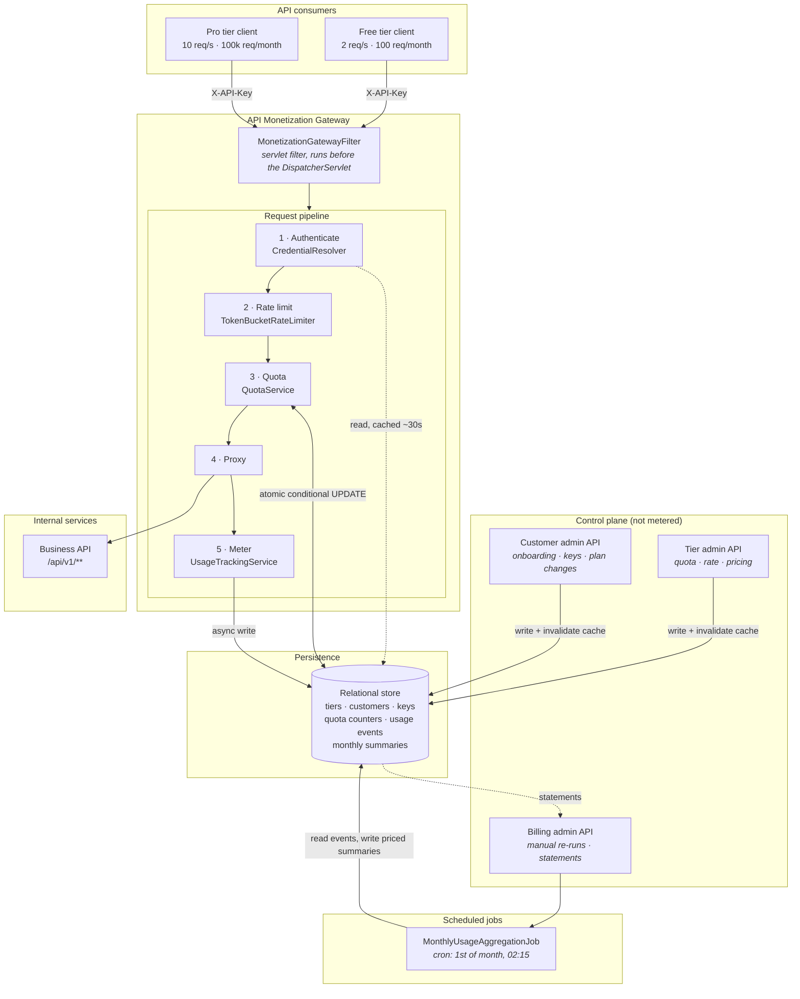
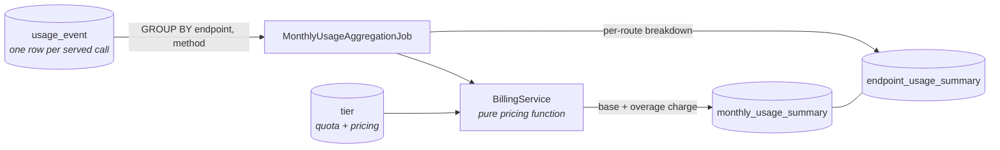

# System Architecture

## Component view



## Request sequence

```mermaid
sequenceDiagram
    autonumber
    participant Client
    participant Filter as Gateway filter
    participant Auth as CredentialResolver
    participant RL as TokenBucketRateLimiter
    participant Quota as QuotaService
    participant Svc as Internal service
    participant Usage as UsageTrackingService
    participant DB as Database

    Client->>Filter: GET /api/v1/weather (X-API-Key)

    Filter->>Auth: resolve(key)
    alt cache hit
        Auth-->>Filter: customer + user + tier
    else cache miss
        Auth->>DB: SHA-256 lookup + subscription + tier
        DB-->>Auth: binding
        Auth-->>Filter: customer + user + tier
    end

    Filter->>RL: tryAcquire(customer, tier policy)
    alt no permit
        RL-->>Filter: denied (retry in N ms)
        Filter-->>Client: 429 RATE_LIMIT_EXCEEDED + Retry-After
    else permit granted
        RL-->>Filter: allowed (remaining)

        Filter->>Quota: tryConsume(customer, tier)
        Quota->>DB: UPDATE quota_counter SET used = used + 1<br/>WHERE used &lt; :limit
        alt 0 rows affected and no overage on the tier
            DB-->>Quota: quota exhausted
            Filter-->>Client: 429 QUOTA_EXCEEDED
        else consumed
            DB-->>Quota: consumed
            Filter->>Svc: forward request
            Svc-->>Filter: 200 payload
            Filter->>Usage: record(customer, user, endpoint, timestamp, ...)
            Usage-)DB: INSERT usage_event (off the request thread)
            Filter-->>Client: 200 + X-RateLimit-* / X-Quota-* headers
        end
    end
```

## Monthly billing pipeline



The job groups in the database rather than in memory, so its footprint is independent of how many
events the month produced. Re-running a period replaces that period's summaries instead of adding to
them, which is what makes a retry after a partial failure safe.
