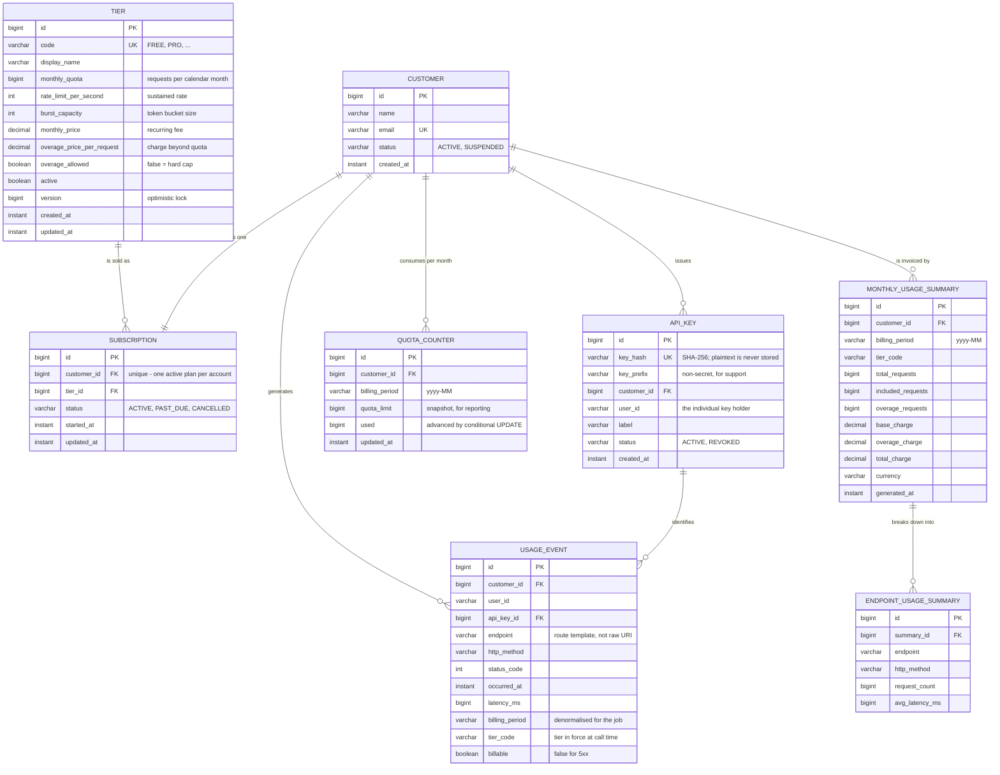

# Entity Relationship Diagram

## Notes on the model

**`QUOTA_COUNTER` is separate from `USAGE_EVENT` on purpose.** Enforcement needs one number it can
read and advance atomically on every request; billing needs the full event history. Deriving the
live counter with `SELECT COUNT(*)` over the events would put a growing aggregate scan on the hot
path, and would still be racy without additional locking.

**`USAGE_EVENT` is deliberately denormalised.** It copies `billing_period` and `tier_code` rather
than joining to find them, so a customer who changes plan mid-month still has each call priced
against the tier that was in force when it was served, and the aggregation query touches one table.

**Uniqueness carries the concurrency guarantees.** `(customer_id, billing_period)` is unique on
`QUOTA_COUNTER`, which is what makes the lazy create-on-first-request safe, and
`(customer_id, billing_period)` is unique on `MONTHLY_USAGE_SUMMARY`, which is what makes re-running
the billing job idempotent rather than duplicative.
